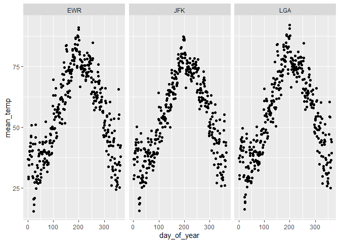

Practice Exam
=============

This practice exam asks you to do several code wrangling tasks that we
have done in class so far.

Clone this repo into Rstudio and fill in the necessary code. Then,
commit and push to github. Finally, turn in a link to canvas.

    ## -- Attaching packages ---------------------------------------------------------------------------- tidyverse 1.3.0 --

    ## v ggplot2 3.2.1     v purrr   0.3.3
    ## v tibble  2.1.3     v dplyr   0.8.3
    ## v tidyr   1.0.2     v stringr 1.4.0
    ## v readr   1.3.1     v forcats 0.4.0

    ## -- Conflicts ------------------------------------------------------------------------------- tidyverse_conflicts() --
    ## x dplyr::filter() masks stats::filter()
    ## x dplyr::lag()    masks stats::lag()

Make a plot with three facets, one for each airport in the weather data.
The x-axis should be the day of the year (1:365) and the y-axis should
be the mean temperature recorded on that day, at that airport.

    library(lubridate)

    ## 
    ## Attaching package: 'lubridate'

    ## The following object is masked from 'package:base':
    ## 
    ##     date

    weather %>% mutate(day_of_year = yday(time_hour)) %>% 
      group_by(origin,day_of_year) %>% 
      summarise(mean_temp=mean(temp)) %>% 
      ggplot()+ geom_point(mapping = aes(x = day_of_year, y = mean_temp)) + facet_wrap(~origin)

    ## Warning: Removed 1 rows containing missing values (geom_point).

Make a non-tidy matrix of that data where each row is an airport and
each column is a day of the year.

    weather %>% mutate(day_of_year = yday(time_hour)) %>% 
      group_by(origin,day_of_year) %>% 
      summarise(mean_temp=mean(temp)) %>% 
      pivot_wider(names_from = day_of_year,values_from = mean_temp,names_prefix = "day")

    ## # A tibble: 3 x 365
    ## # Groups:   origin [3]
    ##   origin  day1  day2  day3  day4  day5  day6  day7  day8  day9 day10 day11 day12
    ##   <chr>  <dbl> <dbl> <dbl> <dbl> <dbl> <dbl> <dbl> <dbl> <dbl> <dbl> <dbl> <dbl>
    ## 1 EWR     36.8  28.7  29.6  34.3  36.6  39.9  40.3  38.6  42.1  43.6  42.0  46.0
    ## 2 JFK     36.9  28.6  30.1  34.7  36.8  39.3  40.1  39.4  42.7  43.6  41.3  45.0
    ## 3 LGA     37.2  28.8  30.3  35.8  38.3  41.0  41.4  42.3  44.9  44.3  40.3  43.9
    ## # ... with 352 more variables: day13 <dbl>, day14 <dbl>, day15 <dbl>,
    ## #   day16 <dbl>, day17 <dbl>, day18 <dbl>, day19 <dbl>, day20 <dbl>,
    ## #   day21 <dbl>, day22 <dbl>, day23 <dbl>, day24 <dbl>, day25 <dbl>,
    ## #   day26 <dbl>, day27 <dbl>, day28 <dbl>, day29 <dbl>, day30 <dbl>,
    ## #   day31 <dbl>, day32 <dbl>, day33 <dbl>, day34 <dbl>, day35 <dbl>,
    ## #   day36 <dbl>, day37 <dbl>, day38 <dbl>, day39 <dbl>, day40 <dbl>,
    ## #   day41 <dbl>, day42 <dbl>, day43 <dbl>, day44 <dbl>, day45 <dbl>,
    ## #   day46 <dbl>, day47 <dbl>, day48 <dbl>, day49 <dbl>, day50 <dbl>,
    ## #   day51 <dbl>, day52 <dbl>, day53 <dbl>, day54 <dbl>, day55 <dbl>,
    ## #   day56 <dbl>, day57 <dbl>, day58 <dbl>, day59 <dbl>, day60 <dbl>,
    ## #   day61 <dbl>, day62 <dbl>, day63 <dbl>, day64 <dbl>, day65 <dbl>,
    ## #   day66 <dbl>, day67 <dbl>, day68 <dbl>, day69 <dbl>, day70 <dbl>,
    ## #   day71 <dbl>, day72 <dbl>, day73 <dbl>, day74 <dbl>, day75 <dbl>,
    ## #   day76 <dbl>, day77 <dbl>, day78 <dbl>, day79 <dbl>, day80 <dbl>,
    ## #   day81 <dbl>, day82 <dbl>, day83 <dbl>, day84 <dbl>, day85 <dbl>,
    ## #   day86 <dbl>, day87 <dbl>, day88 <dbl>, day89 <dbl>, day90 <dbl>,
    ## #   day91 <dbl>, day92 <dbl>, day93 <dbl>, day94 <dbl>, day95 <dbl>,
    ## #   day96 <dbl>, day97 <dbl>, day98 <dbl>, day99 <dbl>, day100 <dbl>,
    ## #   day101 <dbl>, day102 <dbl>, day103 <dbl>, day104 <dbl>, day105 <dbl>,
    ## #   day106 <dbl>, day107 <dbl>, day108 <dbl>, day109 <dbl>, day110 <dbl>,
    ## #   day111 <dbl>, day112 <dbl>, ...

For each (airport, day) contruct a tidy data set of the airport’s
“performance” as the proportion of flights that departed less than an
hour late.

    left_join(flights,weather,by=c("time_hour","origin")) %>% 
      mutate(day_of_year = yday(time_hour)) %>% 
      group_by(origin, day_of_year) %>% 
      summarise(p = sum(dep_delay<60,na.rm = T),n=n()) %>% 
      mutate(performance = p/n)

    ## # A tibble: 1,095 x 5
    ## # Groups:   origin [3]
    ##    origin day_of_year     p     n performance
    ##    <chr>        <dbl> <int> <int>       <dbl>
    ##  1 EWR              1   279   305       0.915
    ##  2 EWR              2   288   350       0.823
    ##  3 EWR              3   326   336       0.970
    ##  4 EWR              4   315   339       0.929
    ##  5 EWR              5   229   238       0.962
    ##  6 EWR              6   285   301       0.947
    ##  7 EWR              7   315   342       0.921
    ##  8 EWR              8   326   334       0.976
    ##  9 EWR              9   327   336       0.973
    ## 10 EWR             10   336   344       0.977
    ## # ... with 1,085 more rows

Construct a tidy data set to that give weather summaries for each
(airport, day). Use the total precipitation, minimum visibility, maximum
wind\_gust, and average wind\_speed.

    weather %>% mutate(day_of_year = yday(time_hour)) %>% 
      group_by(origin,day_of_year) %>% 
      summarise(total_precip=sum(precip),min_visib=min(visib),avg_speed=mean(wind_speed))

    ## # A tibble: 1,092 x 5
    ## # Groups:   origin [3]
    ##    origin day_of_year total_precip min_visib avg_speed
    ##    <chr>        <dbl>        <dbl>     <dbl>     <dbl>
    ##  1 EWR              1            0        10     13.2 
    ##  2 EWR              2            0        10     10.9 
    ##  3 EWR              3            0        10      8.58
    ##  4 EWR              4            0        10     14.0 
    ##  5 EWR              5            0        10      9.40
    ##  6 EWR              6            0         6      9.11
    ##  7 EWR              7            0        10      7.34
    ##  8 EWR              8            0         8      7.19
    ##  9 EWR              9            0         6      5.99
    ## 10 EWR             10            0        10      8.92
    ## # ... with 1,082 more rows

Construct a linear model to predict the performance of each
(airport,day) using the weather summaries and a “fixed effect” for each
airport. Display the summaries.

    perform=left_join(flights,weather,by=c("time_hour","origin")) %>% 
      mutate(day_of_year = yday(time_hour)) %>% 
      group_by(origin, day_of_year) %>% 
      summarise(p = sum(dep_delay<60,na.rm = T),n=n()) %>% 
      mutate(performance = p/n)
    s=weather %>% mutate(day_of_year = yday(time_hour)) %>% 
      group_by(origin,day_of_year) %>% 
      summarise(total_precip=sum(precip),min_visib=min(visib),avg_speed=mean(wind_speed))
    d=left_join(s,perform,by=c("origin","day_of_year"))
    m=lm(performance~total_precip+min_visib+avg_speed+origin,data=d)
    summary(m)

    ## 
    ## Call:
    ## lm(formula = performance ~ total_precip + min_visib + avg_speed + 
    ##     origin, data = d)
    ## 
    ## Residuals:
    ##      Min       1Q   Median       3Q      Max 
    ## -0.48225 -0.02142  0.02021  0.04562  0.23993 
    ## 
    ## Coefficients:
    ##                Estimate Std. Error t value Pr(>|t|)    
    ## (Intercept)   0.8261067  0.0106321  77.699  < 2e-16 ***
    ## total_precip -0.0659955  0.0100735  -6.551 8.80e-11 ***
    ## min_visib     0.0125825  0.0009044  13.912  < 2e-16 ***
    ## avg_speed    -0.0031358  0.0006692  -4.686 3.14e-06 ***
    ## originJFK     0.0329051  0.0068644   4.794 1.87e-06 ***
    ## originLGA     0.0201975  0.0067394   2.997  0.00279 ** 
    ## ---
    ## Signif. codes:  0 '***' 0.001 '**' 0.01 '*' 0.05 '.' 0.1 ' ' 1
    ## 
    ## Residual standard error: 0.0902 on 1082 degrees of freedom
    ##   (4 observations deleted due to missingness)
    ## Multiple R-squared:  0.3037, Adjusted R-squared:  0.3005 
    ## F-statistic: 94.41 on 5 and 1082 DF,  p-value: < 2.2e-16

Repeat the above, but only for EWR. Obviously, exclude the fixed effect
for each airport.

    d.1 = filter(d,origin == "EWR")
    m.1=lm(performance~total_precip+min_visib+avg_speed,data=d.1)
    summary(m.1)

    ## 
    ## Call:
    ## lm(formula = performance ~ total_precip + min_visib + avg_speed, 
    ##     data = d.1)
    ## 
    ## Residuals:
    ##      Min       1Q   Median       3Q      Max 
    ## -0.37259 -0.03524  0.02270  0.05262  0.25059 
    ## 
    ## Coefficients:
    ##               Estimate Std. Error t value Pr(>|t|)    
    ## (Intercept)   0.823419   0.016934  48.624  < 2e-16 ***
    ## total_precip -0.065605   0.016847  -3.894 0.000117 ***
    ## min_visib     0.014297   0.001676   8.529 4.18e-16 ***
    ## avg_speed    -0.004229   0.001124  -3.761 0.000198 ***
    ## ---
    ## Signif. codes:  0 '***' 0.001 '**' 0.01 '*' 0.05 '.' 0.1 ' ' 1
    ## 
    ## Residual standard error: 0.09319 on 359 degrees of freedom
    ##   (1 observation deleted due to missingness)
    ## Multiple R-squared:  0.3205, Adjusted R-squared:  0.3148 
    ## F-statistic: 56.45 on 3 and 359 DF,  p-value: < 2.2e-16
